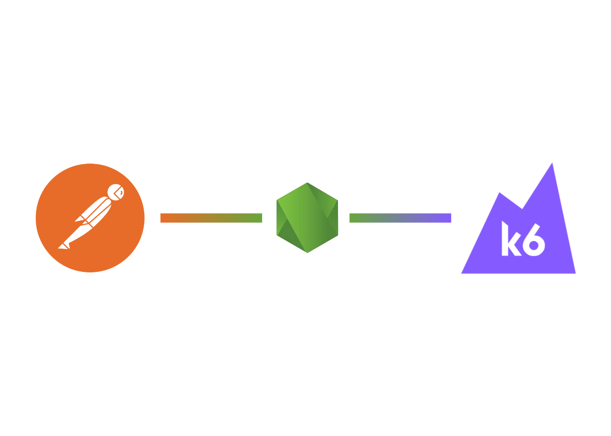

> This is a fork of the original [postman-to-k6](https://github.com/grafana/postman-to-k6) repo, which contains new features & fixes.


<div align="center">



# Postman-to-k6

Converts a [Postman collection](https://www.getpostman.com/docs/collections) to a [k6 script](https://docs.k6.io/docs).


 

</div>

<br/><br/>

## Content

- [Features](#features)
- [Installation](#installation)
  - [Local Installation (recommended)](#local-installation-recommended)
  - [Global Installation](#global-installation)
  - [Docker](#docker)
- [Usage](#usage)
- [Options](#options)
  - [Iterations](#iterations)
  - [Environment Variables](#environment-variables)
  - [Global Variables](#global-variables)
  - [CSV Data File](#csv-data-file)
  - [JSON Data File](#json-data-file)
  - [Separate](#separate)
- [Docker Usage](#docker-usage)
- [Examples](#examples)
- [Unsupported Features](#unsupported-features)
- [Other similar tools](#other-similar-tools)
- [Credits](#credits)

## Features

- Prerequest scripts.
- Test scripts.
- Variables (at all scopes + dynamic).
- Data files.
- Authentication methods (except Hawk).
- File uploads.
- `postman.*` interface ([exceptions below](#unsupported-features)).
- `pm.*` interface ([exceptions below](#unsupported-features)).
- Support for [Postman Dynamic Variables](https://learning.postman.com/docs/writing-scripts/script-references/variables-list/) & ReplaceIn function.
- Global variables exposed by Postman: `globals` `environment` `data`
  `iteration`.
- `xml2Json` conversion.
- All [Postman Schema](https://schema.getpostman.com/) versions.

## Installation

### Local Installation (recommended)

While possible to install globally, we recommend that you, if possible, add the converter to the `node_modules` of your test project using:

```shell
$ npm install -D postman-to-k6

# or using yarn...

$ yarn add postman-to-k6
```

Note that this will require you to run the converter with `npx postman-to-k6 your-postman-file` or, if you are using an older versions of npm, `./node_modules/.bin/postman-to-k6 your-postman-file`.

### Global Installation

```shell
$ npm install -g postman-to-k6
```

### Docker

The tool is also available for usage in Docker. To download an image with the tool from DockerHub:

```shell
$ docker pull loadimpact/postman-to-k6

```

## Usage

To convert an exported collection to a k6 script:

```shell
$ postman-to-k6 collection.json -o k6-script.js
```

Then run the script in k6, as usual, using:

```shell
$ k6 run k6-script.js
```

## Options

### Iterations

Configures how many times the script will be executed before completion.

| Flag | Verbose        | Default |
| ---- | -------------- | ------: |
| `-i` | `--iterations` |       1 |

Example:

```shell
$ postman-to-k6 collection.json --iterations 25 -o k6-script.js
```

### Environment Variables

Provide environment variables from a JSON file.

| Flag | Verbose         | Default |
| ---- | --------------- | ------- |
| `-e` | `--environment` | N/A     |

Example:

```shell
$ postman-to-k6 collection.json --environment environment.json -o k6-script.js
```

### Global Variables

Provide global variables from a JSON file.

| Flag | Verbose    | Default |
| ---- | ---------- | ------- |
| `-g` | `--global` | N/A     |

```shell
$ postman-to-k6 collection.json --global globals.json -o k6-script.js
```

### CSV Data File

Provide a data file in the CSV format.

| Flag | Verbose | Default |
| ---- | ------- | ------- |
| `-c` | `--csv` | N/A     |

```shell
$ postman-to-k6 collection.json --csv data.csv -o k6-script.js
```

### JSON Data File

Pass in a data file in the JSON format.

| Flag | Verbose  | Default |
| ---- | -------- | ------- |
| `-j` | `--json` | N/A     |

```shell
$ postman-to-k6 collection.json --json data.json -o k6-script.js
```

### K6 Param Options File

Pass [K6 parameter options](https://k6.io/docs/javascript-api/k6-http/params) as a file in JSON format.

| Flag | Verbose       | Default |
| ---- | ------------- | ------- |
|      | `--k6-params` | N/A     |

```shell
$ postman-to-k6 collection.json --k6-params k6-params.json -o k6-script.js
```

### Separate

Split requests into separate files, for easier rearrangement of the logic.

| Flag | Verbose      | Default |
| ---- | ------------ | ------- |
| `-s` | `--separate` | false   |

```shell
$ postman-to-k6 collection.json --separate -o k6-script.js
```

```shell
postman-to-k6 collection.json -s -o k6-script.js
```

### Skip Pre

Skips any pre-request scripts during conversion

| Flag | Verbose      | Default |
| ---- | ------------ | ------- |
|      | `--skip-pre` | false   |

```shell
$ postman-to-k6 collection.json --skip-pre -o k6-script.js
```

### Skip Post

Skips any post-request scripts during conversion

| Flag | Verbose       | Default |
| ---- | ------------- | ------- |
|      | `--skip-post` | false   |

```shell
$ postman-to-k6 collection.json --skip-pre -o k6-script.js
```

## Docker Usage

Using the Docker image, you execute the tool as follows:

```shell
$ docker run -it \
    -v "/path/to/postman/collection/:/postman/" \
    loadimpact/postman-to-k6 \
    /postman/my-collection.json \
    -o /postman/test.js
```

and then execute the k6 test using:

```shell
$ k6 run /path/to/postman/collection/test.js
```

## Examples

A collection of Postman examples are located under `example`.
To run one of the examples, just run it as you would any other command:

```shell
$ postman-to-k6 example/v2/echo.json -o k6-script.js
```

## Unsupported Features

- Sending requests from scripts using `pm.sendRequest`.
- Controlling request execution order using `postman.setNextRequest`.
- Cookie properties, like `hostOnly`, `session`, and `storeId`.
- Textual response messages:
  - `responseCode.name`
  - `responseCode.detail`
  - `pm.response.reason`
  - `pm.response.to.have.status(reason)`
  - `pm.response.to.not.have.status(reason)`
- Properties returning Postman classes:
  - `pm.request.url` `pm.request.headers`
  - `pm.response.headers`
- The Hawk authentication method.
- Deprecated `xmlToJson` method.
- Request IDs are changed. Postman doesn't provide them in the export so we 
  have to generate new ones.

## Other similar tools

- [jmeter-to-k6](https://github.com/loadimpact/jmeter-to-k6/): Convert
  JMeter JMX files to k6 JS.

## Credits

Thanks to [bookmoons](https://github.com/bookmoons) for creating this tool. Also, thanks to [borjacampina](https://github.com/borjacampina) for creating the original incarnation of the tool.
